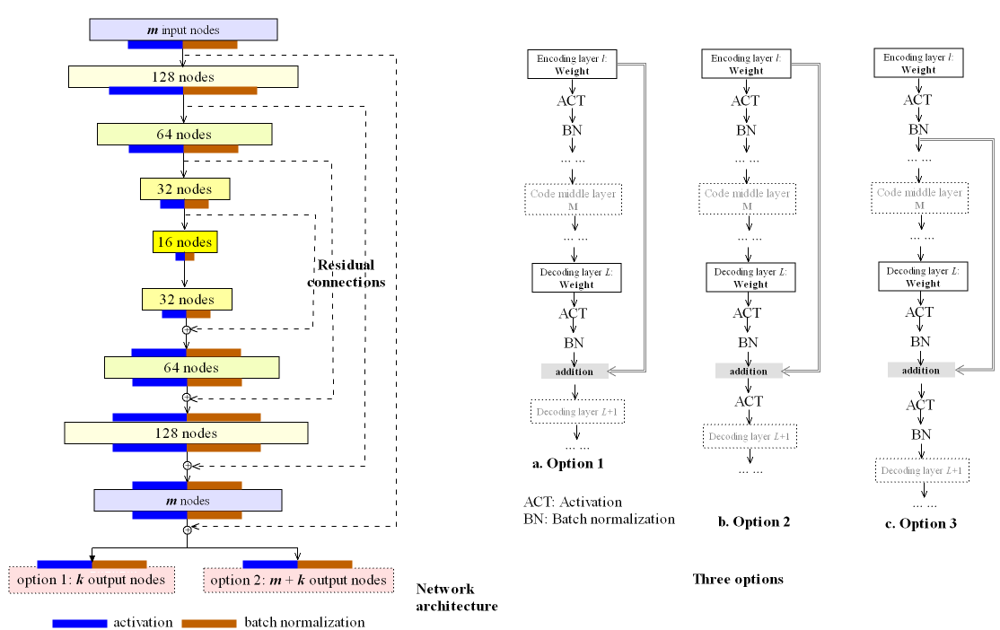
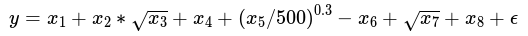
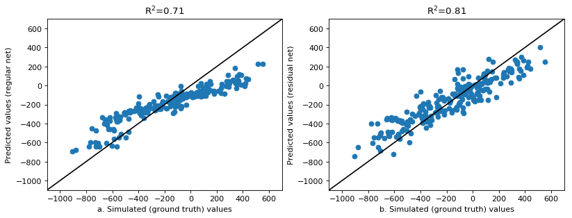
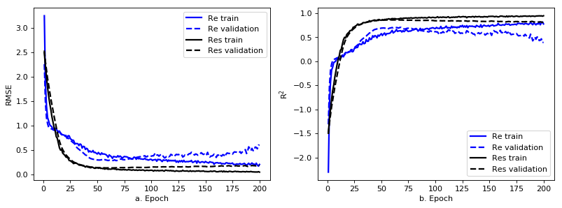
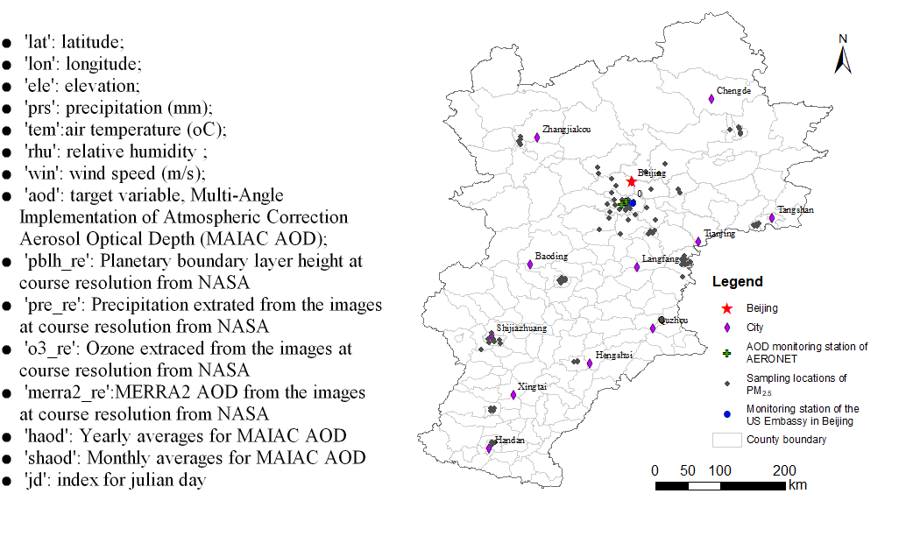
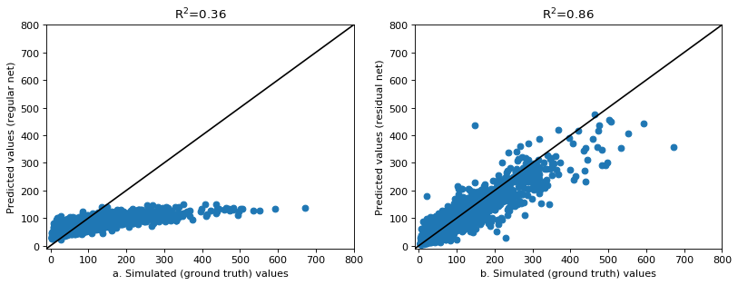
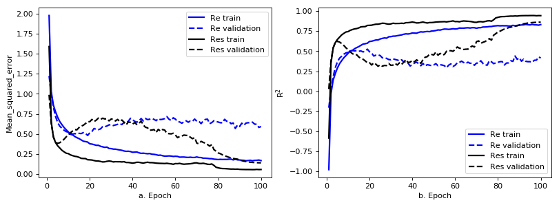
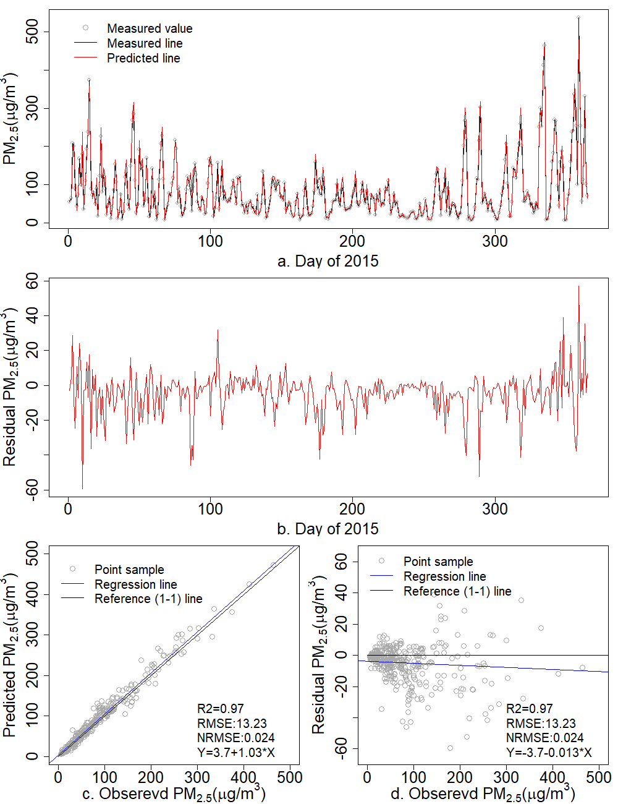

resautonet: A Library of Autoencoder-based Residual Deep Network
================

Construction, use and performance analysis of autoencoder-basd residual deep network
------------------------------------------------------------------------------------

In this architecture,

-   autoencoder is the internal base for a balance connection from the encoding to decoding layers
-   residual connection is constructed in a nested way and the critical component to improve the training time and stability

The following left plot shows the network archtecture and the right one shows three options for the topology of residual connections. 

Installation of the package
---------------------------

1.  You can directly install this package using the following command for the latest version:

          pip install resautonet -U  

2.  You can also clone the repository and then install:

         git clone --recursive https://github.com/lspatial/resautonet.git
         cd resautonet 
         pip install ./setup.py install 

The following code is to import the necessary packages:

``` python
import numpy as np
import numpy.random as nr
import math
from sklearn import preprocessing
from sklearn.model_selection import train_test_split
import os
import pandas as pd 
import keras 
```

    ## Using TensorFlow backend.

``` python
from keras.callbacks import ModelCheckpoint

os.environ["CUDA_DEVICE_ORDER"] = "PCI_BUS_ID"
os.environ["CUDA_VISIBLE_DEVICES"] = '1'

import resautonet 
```

Test 1: the simulated dataset
-----------------------------

The dataset is simulated using the following formula: 

each covariate defined as:
*x*<sub>1</sub> ∼ *U*(1, 100),*x*<sub>2</sub> ∼ *U*(0, 100),*x*<sub>3</sub> ∼ *U*(1, 10),*x*<sub>4</sub> ∼ *U*(1, 100),*x*<sub>5</sub> ∼ *U*(9, 100),*x*<sub>6</sub> ∼ *U*(1, 1009),*x*<sub>7</sub> ∼ *U*(5, 300),*x*<sub>8</sub> *U*(6 ∼ 200)

``` python
simdata=resautonet.simData()
```

<table>
<thead>
<tr>
<th style="text-align:right;">
x1
</th>
<th style="text-align:right;">
x2
</th>
<th style="text-align:right;">
x3
</th>
<th style="text-align:right;">
x4
</th>
<th style="text-align:right;">
x5
</th>
<th style="text-align:right;">
x6
</th>
<th style="text-align:right;">
x7
</th>
<th style="text-align:right;">
x8
</th>
<th style="text-align:right;">
y
</th>
</tr>
</thead>
<tbody>
<tr>
<td style="text-align:right;">
25.541078
</td>
<td style="text-align:right;">
93.37816
</td>
<td style="text-align:right;">
6.313626
</td>
<td style="text-align:right;">
94.21195
</td>
<td style="text-align:right;">
46.74386
</td>
<td style="text-align:right;">
176.85304
</td>
<td style="text-align:right;">
251.25686
</td>
<td style="text-align:right;">
63.99736
</td>
<td style="text-align:right;">
326.0434
</td>
</tr>
<tr>
<td style="text-align:right;">
79.318833
</td>
<td style="text-align:right;">
18.62902
</td>
<td style="text-align:right;">
3.963675
</td>
<td style="text-align:right;">
69.87578
</td>
<td style="text-align:right;">
14.66835
</td>
<td style="text-align:right;">
369.38556
</td>
<td style="text-align:right;">
10.27503
</td>
<td style="text-align:right;">
17.61991
</td>
<td style="text-align:right;">
-245.5792
</td>
</tr>
<tr>
<td style="text-align:right;">
5.602838
</td>
<td style="text-align:right;">
86.17499
</td>
<td style="text-align:right;">
4.958180
</td>
<td style="text-align:right;">
70.02885
</td>
<td style="text-align:right;">
97.43158
</td>
<td style="text-align:right;">
26.45413
</td>
<td style="text-align:right;">
280.29928
</td>
<td style="text-align:right;">
189.22854
</td>
<td style="text-align:right;">
404.8084
</td>
</tr>
<tr>
<td style="text-align:right;">
8.266538
</td>
<td style="text-align:right;">
18.82628
</td>
<td style="text-align:right;">
3.132144
</td>
<td style="text-align:right;">
12.13147
</td>
<td style="text-align:right;">
12.14893
</td>
<td style="text-align:right;">
131.04693
</td>
<td style="text-align:right;">
242.19435
</td>
<td style="text-align:right;">
110.46545
</td>
<td style="text-align:right;">
243.6506
</td>
</tr>
<tr>
<td style="text-align:right;">
84.422718
</td>
<td style="text-align:right;">
94.93493
</td>
<td style="text-align:right;">
2.244544
</td>
<td style="text-align:right;">
89.16290
</td>
<td style="text-align:right;">
49.71727
</td>
<td style="text-align:right;">
16.14748
</td>
<td style="text-align:right;">
219.74188
</td>
<td style="text-align:right;">
97.71448
</td>
<td style="text-align:right;">
584.5033
</td>
</tr>
</tbody>
</table>
You can also load the dataset existing in the package for a test:

``` python
simdata=resautonet.data('sim')
```

<table>
<thead>
<tr>
<th style="text-align:left;">
</th>
<th style="text-align:right;">
x1
</th>
<th style="text-align:right;">
x2
</th>
<th style="text-align:right;">
x3
</th>
<th style="text-align:right;">
x4
</th>
<th style="text-align:right;">
x5
</th>
<th style="text-align:right;">
x6
</th>
<th style="text-align:right;">
x7
</th>
<th style="text-align:right;">
x8
</th>
<th style="text-align:right;">
y
</th>
</tr>
</thead>
<tbody>
<tr>
<td style="text-align:left;">
0
</td>
<td style="text-align:right;">
5.913603
</td>
<td style="text-align:right;">
7.856468
</td>
<td style="text-align:right;">
7.676701
</td>
<td style="text-align:right;">
59.48876
</td>
<td style="text-align:right;">
69.56999
</td>
<td style="text-align:right;">
182.9416
</td>
<td style="text-align:right;">
191.96312
</td>
<td style="text-align:right;">
87.31489
</td>
<td style="text-align:right;">
13.93433
</td>
</tr>
<tr>
<td style="text-align:left;">
1
</td>
<td style="text-align:right;">
43.977562
</td>
<td style="text-align:right;">
85.455399
</td>
<td style="text-align:right;">
8.209722
</td>
<td style="text-align:right;">
15.10615
</td>
<td style="text-align:right;">
46.13133
</td>
<td style="text-align:right;">
768.7709
</td>
<td style="text-align:right;">
197.26448
</td>
<td style="text-align:right;">
136.95654
</td>
<td style="text-align:right;">
-205.81321
</td>
</tr>
<tr>
<td style="text-align:left;">
2
</td>
<td style="text-align:right;">
78.462677
</td>
<td style="text-align:right;">
7.745484
</td>
<td style="text-align:right;">
5.766864
</td>
<td style="text-align:right;">
75.61416
</td>
<td style="text-align:right;">
33.14553
</td>
<td style="text-align:right;">
839.3384
</td>
<td style="text-align:right;">
149.26802
</td>
<td style="text-align:right;">
128.70658
</td>
<td style="text-align:right;">
-629.56243
</td>
</tr>
<tr>
<td style="text-align:left;">
3
</td>
<td style="text-align:right;">
30.656661
</td>
<td style="text-align:right;">
99.536410
</td>
<td style="text-align:right;">
9.184463
</td>
<td style="text-align:right;">
94.19582
</td>
<td style="text-align:right;">
99.44397
</td>
<td style="text-align:right;">
436.1621
</td>
<td style="text-align:right;">
67.87602
</td>
<td style="text-align:right;">
156.86448
</td>
<td style="text-align:right;">
194.97031
</td>
</tr>
<tr>
<td style="text-align:left;">
4
</td>
<td style="text-align:right;">
34.247640
</td>
<td style="text-align:right;">
83.544456
</td>
<td style="text-align:right;">
5.030490
</td>
<td style="text-align:right;">
16.03399
</td>
<td style="text-align:right;">
79.27849
</td>
<td style="text-align:right;">
553.4266
</td>
<td style="text-align:right;">
31.58161
</td>
<td style="text-align:right;">
124.26184
</td>
<td style="text-align:right;">
-212.49447
</td>
</tr>
</tbody>
</table>
Then the pandas's data frame is converted into the numpy array for the models:

``` python
tcol=['x'+str(i) for i in range(1,9)]
X=simdata[tcol].values 
y=simdata['y'].values
y=y.reshape((y.shape[0],1))
```

The data is normalized using the tool of standard scaler:

``` python
scX = preprocessing.StandardScaler().fit(X)
scy = preprocessing.StandardScaler().fit(y)
Xn=scX.transform(X)
yn=scy.transform(y)
print(np.min(y),np.max(y))
```

    ## -943.1592199858045 663.3099522511869

Then, the dataset's samples are separated into three parts, training, validation and test:

``` python
x_train, x_test, y_train,y_test = train_test_split(Xn,yn,
                                      test_size=0.2)
x_train, x_valid, y_train,y_valid = train_test_split(x_train,y_train,
                                      test_size=0.2)
print(x_train.shape,x_valid.shape,y_train.shape,y_valid.shape)
```

    ## (768, 8) (192, 8) (768, 1) (192, 1)

Call the major class, resAutoencoder from resautonet to obtain the network. Critical network parameters:

        * nfea: 8 ; 
        * layernNodes: [32,16,8,4] ;
        * acts: 'relu';
        * extranOutput: 1 ;
        * batchnorm: True ;
        * reg:  L1 and L2 ;
        * inresidual: True (residual network);
        * defact: 'tanh' ;
        * outputtype: 0, just the target variable to be output. 

``` python
from resautonet.model import r2KAuto,r2K
#Set the path to save the model's parameters 
wtPath='/tmp/res_sim_wei.hdf5'
# Set the check point to check the validation 
checkpointw=ModelCheckpoint(wtPath, monitor="loss",verbose=0, save_best_only=True, mode="min")
#Call the model class 
modelCls = resautonet.model.resAutoencoder(x_train.shape[1], [32,16,8,4],'relu',1,inresidual=True,reg=keras.regularizers.l1_l2(0),
                          batchnorm=True,outnres=None,defact='linear',outputtype=0)
#Get the residual autoencoder network 
resmodel = modelCls.resAutoNet()
#Show the network model's topology 
resmodel.summary()
#Complie the network model 
```

    ## __________________________________________________________________________________________________
    ## Layer (type)                    Output Shape         Param #     Connected to                     
    ## ==================================================================================================
    ## feat (InputLayer)               (None, 8)            0                                            
    ## __________________________________________________________________________________________________
    ## dense_1 (Dense)                 (None, 32)           288         feat[0][0]                       
    ## __________________________________________________________________________________________________
    ## batch_normalization_1 (BatchNor (None, 32)           128         dense_1[0][0]                    
    ## __________________________________________________________________________________________________
    ## activation_1 (Activation)       (None, 32)           0           batch_normalization_1[0][0]      
    ## __________________________________________________________________________________________________
    ## batch_normalization_2 (BatchNor (None, 32)           128         activation_1[0][0]               
    ## __________________________________________________________________________________________________
    ## dense_2 (Dense)                 (None, 16)           528         batch_normalization_2[0][0]      
    ## __________________________________________________________________________________________________
    ## batch_normalization_3 (BatchNor (None, 16)           64          dense_2[0][0]                    
    ## __________________________________________________________________________________________________
    ## activation_2 (Activation)       (None, 16)           0           batch_normalization_3[0][0]      
    ## __________________________________________________________________________________________________
    ## batch_normalization_4 (BatchNor (None, 16)           64          activation_2[0][0]               
    ## __________________________________________________________________________________________________
    ## dense_3 (Dense)                 (None, 8)            136         batch_normalization_4[0][0]      
    ## __________________________________________________________________________________________________
    ## batch_normalization_5 (BatchNor (None, 8)            32          dense_3[0][0]                    
    ## __________________________________________________________________________________________________
    ## activation_3 (Activation)       (None, 8)            0           batch_normalization_5[0][0]      
    ## __________________________________________________________________________________________________
    ## batch_normalization_6 (BatchNor (None, 8)            32          activation_3[0][0]               
    ## __________________________________________________________________________________________________
    ## dense_4 (Dense)                 (None, 4)            36          batch_normalization_6[0][0]      
    ## __________________________________________________________________________________________________
    ## batch_normalization_7 (BatchNor (None, 4)            16          dense_4[0][0]                    
    ## __________________________________________________________________________________________________
    ## activation_4 (Activation)       (None, 4)            0           batch_normalization_7[0][0]      
    ## __________________________________________________________________________________________________
    ## batch_normalization_8 (BatchNor (None, 4)            16          activation_4[0][0]               
    ## __________________________________________________________________________________________________
    ## dropout_1 (Dropout)             (None, 4)            0           batch_normalization_8[0][0]      
    ## __________________________________________________________________________________________________
    ## dense_5 (Dense)                 (None, 8)            40          dropout_1[0][0]                  
    ## __________________________________________________________________________________________________
    ## batch_normalization_9 (BatchNor (None, 8)            32          dense_5[0][0]                    
    ## __________________________________________________________________________________________________
    ## activation_5 (Activation)       (None, 8)            0           batch_normalization_9[0][0]      
    ## __________________________________________________________________________________________________
    ## batch_normalization_10 (BatchNo (None, 8)            32          activation_5[0][0]               
    ## __________________________________________________________________________________________________
    ## add_1 (Add)                     (None, 8)            0           batch_normalization_6[0][0]      
    ##                                                                  batch_normalization_10[0][0]     
    ## __________________________________________________________________________________________________
    ## batch_normalization_11 (BatchNo (None, 8)            32          add_1[0][0]                      
    ## __________________________________________________________________________________________________
    ## activation_6 (Activation)       (None, 8)            0           batch_normalization_11[0][0]     
    ## __________________________________________________________________________________________________
    ## dense_6 (Dense)                 (None, 16)           144         activation_6[0][0]               
    ## __________________________________________________________________________________________________
    ## batch_normalization_12 (BatchNo (None, 16)           64          dense_6[0][0]                    
    ## __________________________________________________________________________________________________
    ## activation_7 (Activation)       (None, 16)           0           batch_normalization_12[0][0]     
    ## __________________________________________________________________________________________________
    ## batch_normalization_13 (BatchNo (None, 16)           64          activation_7[0][0]               
    ## __________________________________________________________________________________________________
    ## add_2 (Add)                     (None, 16)           0           batch_normalization_4[0][0]      
    ##                                                                  batch_normalization_13[0][0]     
    ## __________________________________________________________________________________________________
    ## batch_normalization_14 (BatchNo (None, 16)           64          add_2[0][0]                      
    ## __________________________________________________________________________________________________
    ## activation_8 (Activation)       (None, 16)           0           batch_normalization_14[0][0]     
    ## __________________________________________________________________________________________________
    ## dense_7 (Dense)                 (None, 32)           544         activation_8[0][0]               
    ## __________________________________________________________________________________________________
    ## batch_normalization_15 (BatchNo (None, 32)           128         dense_7[0][0]                    
    ## __________________________________________________________________________________________________
    ## activation_9 (Activation)       (None, 32)           0           batch_normalization_15[0][0]     
    ## __________________________________________________________________________________________________
    ## batch_normalization_16 (BatchNo (None, 32)           128         activation_9[0][0]               
    ## __________________________________________________________________________________________________
    ## add_3 (Add)                     (None, 32)           0           batch_normalization_2[0][0]      
    ##                                                                  batch_normalization_16[0][0]     
    ## __________________________________________________________________________________________________
    ## batch_normalization_17 (BatchNo (None, 32)           128         add_3[0][0]                      
    ## __________________________________________________________________________________________________
    ## activation_10 (Activation)      (None, 32)           0           batch_normalization_17[0][0]     
    ## __________________________________________________________________________________________________
    ## dense_8 (Dense)                 (None, 8)            264         activation_10[0][0]              
    ## __________________________________________________________________________________________________
    ## activation_11 (Activation)      (None, 8)            0           dense_8[0][0]                    
    ## __________________________________________________________________________________________________
    ## batch_normalization_18 (BatchNo (None, 8)            32          activation_11[0][0]              
    ## __________________________________________________________________________________________________
    ## add_4 (Add)                     (None, 8)            0           feat[0][0]                       
    ##                                                                  batch_normalization_18[0][0]     
    ## __________________________________________________________________________________________________
    ## activation_12 (Activation)      (None, 8)            0           add_4[0][0]                      
    ## __________________________________________________________________________________________________
    ## batch_normalization_19 (BatchNo (None, 8)            32          activation_12[0][0]              
    ## __________________________________________________________________________________________________
    ## dense_9 (Dense)                 (None, 1)            9           batch_normalization_19[0][0]     
    ## ==================================================================================================
    ## Total params: 3,205
    ## Trainable params: 2,597
    ## Non-trainable params: 608
    ## __________________________________________________________________________________________________

``` python
resmodel.compile(optimizer="adam", loss= 'mean_squared_error',#mean_squared_error bce_dice_loss, #jaccard_coef_loss, jaccardent_coef_loss1
      metrics=['mean_squared_error',r2KAuto,r2K])
```

``` python
#Starting to train the model... ... 
fhist_res=resmodel.fit(x_train, y_train, batch_size=128, epochs=200, verbose=0, shuffle=True,
           validation_data=(x_valid, y_valid),callbacks=[checkpointw])
```

Test the independent dataset using the trained model. RMSE and Rsquared are used as the metrics.

``` python
from resautonet.model import rsquared, rmse 
resmodel.load_weights(wtPath)
resmodel.compile(optimizer="adam", loss= 'mean_squared_error',  metrics=['mean_squared_error',r2KAuto,r2K])
y_test_pred=resmodel.predict(x_test)

obs=scy.inverse_transform(y_test[:,-1])
preres=scy.inverse_transform(y_test_pred[:,-1])

r2_res=rsquared(obs,preres)
rmse_res=rmse(obs,preres)
print("indepdendent test for residual deep network: r2-",r2_res,"rmse:",rmse_res)
```

    ## indepdendent test for residual deep network: r2- 0.8068514591712673 rmse: 138.6084275706671

Call the major class, resAutoencoder from resautonet to obtain the network without residual connection, i.e. regular autoencoder deep network bying setting the argument of inresidual as False (the other arguments are the same):

``` python
wtPath_no='/tmp/nores_sim_wei.hdf5'
checkpointw=ModelCheckpoint(wtPath, monitor="loss",verbose=0, save_best_only=True, mode="min")
    
modelCls =resautonet.model.resAutoencoder(x_train.shape[1], [32,16,8,4],'relu',1,inresidual=False,reg=keras.regularizers.l1_l2(0),
                          batchnorm=True,outnres=None,defact='linear',outputtype=0)
noresmodel = modelCls.resAutoNet()
noresmodel.summary()
```

    ## _________________________________________________________________
    ## Layer (type)                 Output Shape              Param #   
    ## =================================================================
    ## feat (InputLayer)            (None, 8)                 0         
    ## _________________________________________________________________
    ## dense_10 (Dense)             (None, 32)                288       
    ## _________________________________________________________________
    ## batch_normalization_20 (Batc (None, 32)                128       
    ## _________________________________________________________________
    ## activation_13 (Activation)   (None, 32)                0         
    ## _________________________________________________________________
    ## batch_normalization_21 (Batc (None, 32)                128       
    ## _________________________________________________________________
    ## dense_11 (Dense)             (None, 16)                528       
    ## _________________________________________________________________
    ## batch_normalization_22 (Batc (None, 16)                64        
    ## _________________________________________________________________
    ## activation_14 (Activation)   (None, 16)                0         
    ## _________________________________________________________________
    ## batch_normalization_23 (Batc (None, 16)                64        
    ## _________________________________________________________________
    ## dense_12 (Dense)             (None, 8)                 136       
    ## _________________________________________________________________
    ## batch_normalization_24 (Batc (None, 8)                 32        
    ## _________________________________________________________________
    ## activation_15 (Activation)   (None, 8)                 0         
    ## _________________________________________________________________
    ## batch_normalization_25 (Batc (None, 8)                 32        
    ## _________________________________________________________________
    ## dense_13 (Dense)             (None, 4)                 36        
    ## _________________________________________________________________
    ## batch_normalization_26 (Batc (None, 4)                 16        
    ## _________________________________________________________________
    ## activation_16 (Activation)   (None, 4)                 0         
    ## _________________________________________________________________
    ## batch_normalization_27 (Batc (None, 4)                 16        
    ## _________________________________________________________________
    ## dropout_2 (Dropout)          (None, 4)                 0         
    ## _________________________________________________________________
    ## dense_14 (Dense)             (None, 8)                 40        
    ## _________________________________________________________________
    ## batch_normalization_28 (Batc (None, 8)                 32        
    ## _________________________________________________________________
    ## activation_17 (Activation)   (None, 8)                 0         
    ## _________________________________________________________________
    ## batch_normalization_29 (Batc (None, 8)                 32        
    ## _________________________________________________________________
    ## dense_15 (Dense)             (None, 16)                144       
    ## _________________________________________________________________
    ## batch_normalization_30 (Batc (None, 16)                64        
    ## _________________________________________________________________
    ## activation_18 (Activation)   (None, 16)                0         
    ## _________________________________________________________________
    ## batch_normalization_31 (Batc (None, 16)                64        
    ## _________________________________________________________________
    ## dense_16 (Dense)             (None, 32)                544       
    ## _________________________________________________________________
    ## batch_normalization_32 (Batc (None, 32)                128       
    ## _________________________________________________________________
    ## activation_19 (Activation)   (None, 32)                0         
    ## _________________________________________________________________
    ## batch_normalization_33 (Batc (None, 32)                128       
    ## _________________________________________________________________
    ## dense_17 (Dense)             (None, 8)                 264       
    ## _________________________________________________________________
    ## activation_20 (Activation)   (None, 8)                 0         
    ## _________________________________________________________________
    ## batch_normalization_34 (Batc (None, 8)                 32        
    ## _________________________________________________________________
    ## dense_18 (Dense)             (None, 1)                 9         
    ## =================================================================
    ## Total params: 2,949
    ## Trainable params: 2,469
    ## Non-trainable params: 480
    ## _________________________________________________________________

``` python
noresmodel.compile(optimizer="adam", loss= 'mean_squared_error',#mean_squared_error bce_dice_loss, #jaccard_coef_loss, jaccardent_coef_loss1
      metrics=['mean_squared_error',r2KAuto,r2K])
```

``` python
#Train the regular network 
fhist_nores=noresmodel.fit(x_train, y_train, batch_size=64, epochs=200, verbose=0, shuffle=True,
           validation_data=(x_valid, y_valid),callbacks=[checkpointw])
```

``` python
noresmodel.load_weights(wtPath_no)
noresmodel.compile(optimizer="adam", loss= 'mean_squared_error',  metrics=['mean_squared_error',r2KAuto,r2K])
y_test_pred=noresmodel.predict(x_test)

obs=scy.inverse_transform(y_test[:,-1])
prenores=scy.inverse_transform(y_test_pred[:,-1])

r2_nores=rsquared(obs,prenores)
rmse_nores=rmse(obs,prenores)
print("indepdendent test for regular autoencoder network: r2-",r2_nores,"rmse:",rmse_nores)
```

    ## indepdendent test for regular autoencoder network: r2- 0.7141947730642652 rmse: 168.6083213133464

Then compare the scatter plots of residual deep network and regular network to see the difference in the distributions of their predictions :

``` python
import matplotlib.pyplot as plt

def connectpoints(x,y,p1,p2):
    x1, x2 = x[p1], x[p2]
    y1, y2 = y[p1], y[p2]
    plt.plot([x1,x2],[y1,y2],'k-')
```

``` python
silent=plt.figure(num=None, figsize=(12,4), dpi=80, facecolor='w', edgecolor='k')
silent=plt.subplot(121)
silent=plt.scatter(obs,prenores)
silent=plt.xlim(-1100,700)
silent=plt.ylim(-1100,700)
#plt.axis('equal')
silent=plt.title("$\mathregular{R^2}$="+str(np.round(r2_nores,2)))
silent=plt.xlabel("a. Simulated (ground truth) values")
silent=plt.ylabel('Predicted values (regular net)')
x=[-1100 , 700]
y=[ -1100, 700]
connectpoints(x,y,0,1)
silent=plt.subplot(122)
silent=plt.scatter(obs,preres)
silent=plt.xlim(-1100,700)
silent=plt.ylim(-1100,700)
#plt.axis('equal')
silent=plt.title("$\mathregular{R^2}$="+str(np.round(r2_res,2)))
silent=plt.xlabel("b. Simulated (ground truth) values")
silent=plt.ylabel('Predicted values (residual net)')
x=[-1100 , 700]
y=[ -1100, 700]
connectpoints(x,y,0,1)
silent=plt.savefig('figs/simsca.png', bbox_inches='tight')
```



Compare the training curves of RMSE and R<sup>2</sup> of residual deep network to check the difference in convergence and training efficiency:

``` python
rhDf_nores=pd.DataFrame(fhist_nores.history) 
rhDf_res=pd.DataFrame(fhist_res.history) 
rhDf_nores['epoch']=pd.Series(np.arange(1,len(rhDf_nores)+1))
rhDf_res['epoch']=pd.Series(np.arange(1,len(rhDf_res)+1))
silent=plt.figure(num=None, figsize=(12,4), dpi=80, facecolor='w', edgecolor='k')
silent=plt.subplot(121)
silent=plt.plot( 'epoch', 'mean_squared_error', data=rhDf_nores, marker='', markerfacecolor='blue', markersize=12, color='blue',      
        linewidth=2,label='Re train')
silent=plt.plot( 'epoch', 'val_mean_squared_error', data=rhDf_nores, marker='', color='blue', linewidth=2,linestyle='dashed',label="Re validation")
silent=plt.plot( 'epoch', 'mean_squared_error', data=rhDf_res,marker='', color='black', linewidth=2, label="Res train")
silent=plt.plot( 'epoch', 'val_mean_squared_error', data=rhDf_res,marker='', color='black', linewidth=2, linestyle='dashed', label="Res validation")
silent=plt.legend()
silent=plt.xlabel('a. Epoch')
silent=plt.ylabel('RMSE')
silent=plt.subplot(122)
silent=plt.plot( 'epoch', 'r2KAuto', data=rhDf_nores, marker='', markerfacecolor='blue', markersize=12, color='blue', linewidth=2,label='Re train')
silent=plt.plot( 'epoch', 'val_r2KAuto', data=rhDf_nores, marker='', color='blue', linewidth=2,linestyle='dashed',label="Re validation")
silent=plt.plot( 'epoch', 'r2KAuto', data=rhDf_res,marker='', color='black', linewidth=2, label="Res train")
silent=plt.plot( 'epoch', 'val_r2KAuto', data=rhDf_res,marker='', color='black', linewidth=2, linestyle='dashed', label="Res validation")
silent=plt.legend()
silent=plt.xlabel('b. Epoch')
silent=plt.ylabel(r'$\mathregular{R^2}$') 
silent=plt.savefig('figs/simser.png', bbox_inches='tight')
```



Test 2: real PM<sub>2.5</sub> dataset and relevant covariates for the Beijing-Tianjin\_Tangshan area
----------------------------------------------------------------------------------------------------

This dataset is the real dataset of the 2015 PM<sub>2.5</sub> and the relevant covariates for the Beijing-Tianjin-Tangshan area. It is sampled by the fraction of 0.8 from the original dataset (stratified by the julian day).



First, load the dataset as pandas's DataFrame:

``` python
pm25data=resautonet.data('pm2.5')
```

<table>
<thead>
<tr>
<th style="text-align:left;">
</th>
<th style="text-align:left;">
sites
</th>
<th style="text-align:left;">
site\_name
</th>
<th style="text-align:left;">
city
</th>
<th style="text-align:right;">
lon
</th>
<th style="text-align:right;">
lat
</th>
<th style="text-align:right;">
pm25\_davg
</th>
<th style="text-align:right;">
ele
</th>
<th style="text-align:right;">
prs
</th>
<th style="text-align:right;">
tem
</th>
<th style="text-align:right;">
rhu
</th>
<th style="text-align:right;">
win
</th>
<th style="text-align:right;">
aod
</th>
<th style="text-align:left;">
date
</th>
<th style="text-align:right;">
haod
</th>
<th style="text-align:right;">
shaod
</th>
<th style="text-align:right;">
jd
</th>
<th style="text-align:right;">
pblh\_re
</th>
<th style="text-align:right;">
pre\_re
</th>
<th style="text-align:right;">
o3\_re
</th>
<th style="text-align:right;">
merra2\_re
</th>
<th style="text-align:right;">
month
</th>
</tr>
</thead>
<tbody>
<tr>
<td style="text-align:left;">
0
</td>
<td style="text-align:left;">
榆垡
</td>
<td style="text-align:left;">
京南榆垡，京南区域点
</td>
<td style="text-align:left;">
北京
</td>
<td style="text-align:right;">
116.300
</td>
<td style="text-align:right;">
39.520
</td>
<td style="text-align:right;">
96.16087
</td>
<td style="text-align:right;">
18
</td>
<td style="text-align:right;">
1020.244
</td>
<td style="text-align:right;">
-0.0039212
</td>
<td style="text-align:right;">
36.59867
</td>
<td style="text-align:right;">
18.63971
</td>
<td style="text-align:right;">
0.2426384
</td>
<td style="text-align:left;">
2015-01-01
</td>
<td style="text-align:right;">
0.0018042
</td>
<td style="text-align:right;">
0.0011439
</td>
<td style="text-align:right;">
1
</td>
<td style="text-align:right;">
134.48653
</td>
<td style="text-align:right;">
0
</td>
<td style="text-align:right;">
322.4456
</td>
<td style="text-align:right;">
0.1383012
</td>
<td style="text-align:right;">
1
</td>
</tr>
<tr>
<td style="text-align:left;">
1
</td>
<td style="text-align:left;">
西直门北
</td>
<td style="text-align:left;">
西直门北大街，西直门交通点
</td>
<td style="text-align:left;">
北京
</td>
<td style="text-align:right;">
116.349
</td>
<td style="text-align:right;">
39.954
</td>
<td style="text-align:right;">
48.43043
</td>
<td style="text-align:right;">
55
</td>
<td style="text-align:right;">
1015.730
</td>
<td style="text-align:right;">
-0.4322889
</td>
<td style="text-align:right;">
35.86562
</td>
<td style="text-align:right;">
15.74958
</td>
<td style="text-align:right;">
0.2229189
</td>
<td style="text-align:left;">
2015-01-01
</td>
<td style="text-align:right;">
0.0019746
</td>
<td style="text-align:right;">
0.0012664
</td>
<td style="text-align:right;">
1
</td>
<td style="text-align:right;">
112.89394
</td>
<td style="text-align:right;">
0
</td>
<td style="text-align:right;">
322.8741
</td>
<td style="text-align:right;">
0.1385067
</td>
<td style="text-align:right;">
1
</td>
</tr>
<tr>
<td style="text-align:left;">
2
</td>
<td style="text-align:left;">
平谷
</td>
<td style="text-align:left;">
平谷镇
</td>
<td style="text-align:left;">
北京
</td>
<td style="text-align:right;">
117.100
</td>
<td style="text-align:right;">
40.143
</td>
<td style="text-align:right;">
34.22609
</td>
<td style="text-align:right;">
31
</td>
<td style="text-align:right;">
1018.660
</td>
<td style="text-align:right;">
-0.5404264
</td>
<td style="text-align:right;">
36.61236
</td>
<td style="text-align:right;">
15.28327
</td>
<td style="text-align:right;">
0.1029255
</td>
<td style="text-align:left;">
2015-01-01
</td>
<td style="text-align:right;">
0.0010814
</td>
<td style="text-align:right;">
0.0006855
</td>
<td style="text-align:right;">
1
</td>
<td style="text-align:right;">
95.17511
</td>
<td style="text-align:right;">
0
</td>
<td style="text-align:right;">
327.4055
</td>
<td style="text-align:right;">
0.1406141
</td>
<td style="text-align:right;">
1
</td>
</tr>
<tr>
<td style="text-align:left;">
3
</td>
<td style="text-align:left;">
大兴
</td>
<td style="text-align:left;">
大兴黄村镇
</td>
<td style="text-align:left;">
北京
</td>
<td style="text-align:right;">
116.404
</td>
<td style="text-align:right;">
39.718
</td>
<td style="text-align:right;">
62.60870
</td>
<td style="text-align:right;">
39
</td>
<td style="text-align:right;">
1017.720
</td>
<td style="text-align:right;">
-0.1758164
</td>
<td style="text-align:right;">
36.38532
</td>
<td style="text-align:right;">
17.43535
</td>
<td style="text-align:right;">
0.2385520
</td>
<td style="text-align:left;">
2015-01-01
</td>
<td style="text-align:right;">
0.0019416
</td>
<td style="text-align:right;">
0.0012351
</td>
<td style="text-align:right;">
1
</td>
<td style="text-align:right;">
122.86422
</td>
<td style="text-align:right;">
0
</td>
<td style="text-align:right;">
323.2162
</td>
<td style="text-align:right;">
0.1387565
</td>
<td style="text-align:right;">
1
</td>
</tr>
<tr>
<td style="text-align:left;">
4
</td>
<td style="text-align:left;">
永定门内
</td>
<td style="text-align:left;">
永定门内大街，永定门交通点
</td>
<td style="text-align:left;">
北京
</td>
<td style="text-align:right;">
116.394
</td>
<td style="text-align:right;">
39.876
</td>
<td style="text-align:right;">
53.79565
</td>
<td style="text-align:right;">
52
</td>
<td style="text-align:right;">
1016.125
</td>
<td style="text-align:right;">
-0.3210423
</td>
<td style="text-align:right;">
35.96594
</td>
<td style="text-align:right;">
15.89709
</td>
<td style="text-align:right;">
0.2271125
</td>
<td style="text-align:left;">
2015-01-01
</td>
<td style="text-align:right;">
0.0019626
</td>
<td style="text-align:right;">
0.0012568
</td>
<td style="text-align:right;">
1
</td>
<td style="text-align:right;">
115.71764
</td>
<td style="text-align:right;">
0
</td>
<td style="text-align:right;">
323.1413
</td>
<td style="text-align:right;">
0.1387458
</td>
<td style="text-align:right;">
1
</td>
</tr>
</tbody>
</table>
``` python
#Derive the more variables for the coordinates to capture spatial variation: 
tcols=['lat','lon','ele','prs','tem','rhu','win','aod',
       'pblh_re','pre_re','o3_re','merra2_re','haod','shaod','jd']
pm25data['lat2']=pm25data['lat']*pm25data['lat']
pm25data['lon2']=pm25data['lon']*pm25data['lon']
pm25data['latlon']=pm25data['lat']*pm25data['lon']
tcols.extend(['lat2','lon2','latlon'])
```

``` python
# Data preprocesing, log transformation and normailization: 
X=pm25data[tcols]
y=np.log(pm25data['pm25_davg'])
y=y.reshape((y.shape[0],1))
scX = preprocessing.StandardScaler().fit(X)
scy = preprocessing.StandardScaler().fit(y)
Xn=scX.transform(X)
yn=scy.transform(y)
```

``` python
#Split the dataset into the sets of training, validation and test 
x_train, x_test, y_train,y_test = train_test_split(Xn,yn,
                                      test_size=0.2,stratify=pm25data['jd'].values)
x_train, x_valid, y_train,y_valid = train_test_split(x_train,y_train,
                                      test_size=0.2,stratify=x_train[:,-1])
print(x_train.shape,x_valid.shape,y_train.shape,y_valid.shape,x_test.shape)
```

    ## (13549, 18) (3388, 18) (13549, 1) (3388, 1) (4235, 18)

Call the major class, resAutoencoder from resautonet to obtain the network. Critical network parameters:

        * nfea: 18 ; 
        * layernNodes:[128,96,64,32,16,8] ;
        * acts: 'relu';
        * reg: L1 and L2 ;
        * inresidual: True (residual network);
        * defact: 'linear' ;
        * dropout: 0.1 
        * outputtype: 0, just the target variable to be output. 

``` python
modelCls = resautonet.model.resAutoencoder(x_train.shape[1], [128,96,64,32,16,8],'relu',1,
        reg=keras.regularizers.l1_l2(0),inresidual=True,outnres=None,dropout=0.1,defact='linear')
resmodel = modelCls.resAutoNet()
resmodel.summary()
```

    ## __________________________________________________________________________________________________
    ## Layer (type)                    Output Shape         Param #     Connected to                     
    ## ==================================================================================================
    ## feat (InputLayer)               (None, 18)           0                                            
    ## __________________________________________________________________________________________________
    ## dense_19 (Dense)                (None, 128)          2432        feat[0][0]                       
    ## __________________________________________________________________________________________________
    ## batch_normalization_35 (BatchNo (None, 128)          512         dense_19[0][0]                   
    ## __________________________________________________________________________________________________
    ## activation_21 (Activation)      (None, 128)          0           batch_normalization_35[0][0]     
    ## __________________________________________________________________________________________________
    ## batch_normalization_36 (BatchNo (None, 128)          512         activation_21[0][0]              
    ## __________________________________________________________________________________________________
    ## dense_20 (Dense)                (None, 96)           12384       batch_normalization_36[0][0]     
    ## __________________________________________________________________________________________________
    ## batch_normalization_37 (BatchNo (None, 96)           384         dense_20[0][0]                   
    ## __________________________________________________________________________________________________
    ## activation_22 (Activation)      (None, 96)           0           batch_normalization_37[0][0]     
    ## __________________________________________________________________________________________________
    ## batch_normalization_38 (BatchNo (None, 96)           384         activation_22[0][0]              
    ## __________________________________________________________________________________________________
    ## dense_21 (Dense)                (None, 64)           6208        batch_normalization_38[0][0]     
    ## __________________________________________________________________________________________________
    ## batch_normalization_39 (BatchNo (None, 64)           256         dense_21[0][0]                   
    ## __________________________________________________________________________________________________
    ## activation_23 (Activation)      (None, 64)           0           batch_normalization_39[0][0]     
    ## __________________________________________________________________________________________________
    ## batch_normalization_40 (BatchNo (None, 64)           256         activation_23[0][0]              
    ## __________________________________________________________________________________________________
    ## dense_22 (Dense)                (None, 32)           2080        batch_normalization_40[0][0]     
    ## __________________________________________________________________________________________________
    ## batch_normalization_41 (BatchNo (None, 32)           128         dense_22[0][0]                   
    ## __________________________________________________________________________________________________
    ## activation_24 (Activation)      (None, 32)           0           batch_normalization_41[0][0]     
    ## __________________________________________________________________________________________________
    ## batch_normalization_42 (BatchNo (None, 32)           128         activation_24[0][0]              
    ## __________________________________________________________________________________________________
    ## dense_23 (Dense)                (None, 16)           528         batch_normalization_42[0][0]     
    ## __________________________________________________________________________________________________
    ## batch_normalization_43 (BatchNo (None, 16)           64          dense_23[0][0]                   
    ## __________________________________________________________________________________________________
    ## activation_25 (Activation)      (None, 16)           0           batch_normalization_43[0][0]     
    ## __________________________________________________________________________________________________
    ## batch_normalization_44 (BatchNo (None, 16)           64          activation_25[0][0]              
    ## __________________________________________________________________________________________________
    ## dense_24 (Dense)                (None, 8)            136         batch_normalization_44[0][0]     
    ## __________________________________________________________________________________________________
    ## batch_normalization_45 (BatchNo (None, 8)            32          dense_24[0][0]                   
    ## __________________________________________________________________________________________________
    ## activation_26 (Activation)      (None, 8)            0           batch_normalization_45[0][0]     
    ## __________________________________________________________________________________________________
    ## batch_normalization_46 (BatchNo (None, 8)            32          activation_26[0][0]              
    ## __________________________________________________________________________________________________
    ## dropout_3 (Dropout)             (None, 8)            0           batch_normalization_46[0][0]     
    ## __________________________________________________________________________________________________
    ## dense_25 (Dense)                (None, 16)           144         dropout_3[0][0]                  
    ## __________________________________________________________________________________________________
    ## batch_normalization_47 (BatchNo (None, 16)           64          dense_25[0][0]                   
    ## __________________________________________________________________________________________________
    ## activation_27 (Activation)      (None, 16)           0           batch_normalization_47[0][0]     
    ## __________________________________________________________________________________________________
    ## batch_normalization_48 (BatchNo (None, 16)           64          activation_27[0][0]              
    ## __________________________________________________________________________________________________
    ## add_5 (Add)                     (None, 16)           0           batch_normalization_44[0][0]     
    ##                                                                  batch_normalization_48[0][0]     
    ## __________________________________________________________________________________________________
    ## batch_normalization_49 (BatchNo (None, 16)           64          add_5[0][0]                      
    ## __________________________________________________________________________________________________
    ## activation_28 (Activation)      (None, 16)           0           batch_normalization_49[0][0]     
    ## __________________________________________________________________________________________________
    ## dense_26 (Dense)                (None, 32)           544         activation_28[0][0]              
    ## __________________________________________________________________________________________________
    ## batch_normalization_50 (BatchNo (None, 32)           128         dense_26[0][0]                   
    ## __________________________________________________________________________________________________
    ## activation_29 (Activation)      (None, 32)           0           batch_normalization_50[0][0]     
    ## __________________________________________________________________________________________________
    ## batch_normalization_51 (BatchNo (None, 32)           128         activation_29[0][0]              
    ## __________________________________________________________________________________________________
    ## add_6 (Add)                     (None, 32)           0           batch_normalization_42[0][0]     
    ##                                                                  batch_normalization_51[0][0]     
    ## __________________________________________________________________________________________________
    ## batch_normalization_52 (BatchNo (None, 32)           128         add_6[0][0]                      
    ## __________________________________________________________________________________________________
    ## activation_30 (Activation)      (None, 32)           0           batch_normalization_52[0][0]     
    ## __________________________________________________________________________________________________
    ## dense_27 (Dense)                (None, 64)           2112        activation_30[0][0]              
    ## __________________________________________________________________________________________________
    ## batch_normalization_53 (BatchNo (None, 64)           256         dense_27[0][0]                   
    ## __________________________________________________________________________________________________
    ## activation_31 (Activation)      (None, 64)           0           batch_normalization_53[0][0]     
    ## __________________________________________________________________________________________________
    ## batch_normalization_54 (BatchNo (None, 64)           256         activation_31[0][0]              
    ## __________________________________________________________________________________________________
    ## add_7 (Add)                     (None, 64)           0           batch_normalization_40[0][0]     
    ##                                                                  batch_normalization_54[0][0]     
    ## __________________________________________________________________________________________________
    ## batch_normalization_55 (BatchNo (None, 64)           256         add_7[0][0]                      
    ## __________________________________________________________________________________________________
    ## activation_32 (Activation)      (None, 64)           0           batch_normalization_55[0][0]     
    ## __________________________________________________________________________________________________
    ## dense_28 (Dense)                (None, 96)           6240        activation_32[0][0]              
    ## __________________________________________________________________________________________________
    ## batch_normalization_56 (BatchNo (None, 96)           384         dense_28[0][0]                   
    ## __________________________________________________________________________________________________
    ## activation_33 (Activation)      (None, 96)           0           batch_normalization_56[0][0]     
    ## __________________________________________________________________________________________________
    ## batch_normalization_57 (BatchNo (None, 96)           384         activation_33[0][0]              
    ## __________________________________________________________________________________________________
    ## add_8 (Add)                     (None, 96)           0           batch_normalization_38[0][0]     
    ##                                                                  batch_normalization_57[0][0]     
    ## __________________________________________________________________________________________________
    ## batch_normalization_58 (BatchNo (None, 96)           384         add_8[0][0]                      
    ## __________________________________________________________________________________________________
    ## activation_34 (Activation)      (None, 96)           0           batch_normalization_58[0][0]     
    ## __________________________________________________________________________________________________
    ## dense_29 (Dense)                (None, 128)          12416       activation_34[0][0]              
    ## __________________________________________________________________________________________________
    ## batch_normalization_59 (BatchNo (None, 128)          512         dense_29[0][0]                   
    ## __________________________________________________________________________________________________
    ## activation_35 (Activation)      (None, 128)          0           batch_normalization_59[0][0]     
    ## __________________________________________________________________________________________________
    ## batch_normalization_60 (BatchNo (None, 128)          512         activation_35[0][0]              
    ## __________________________________________________________________________________________________
    ## add_9 (Add)                     (None, 128)          0           batch_normalization_36[0][0]     
    ##                                                                  batch_normalization_60[0][0]     
    ## __________________________________________________________________________________________________
    ## batch_normalization_61 (BatchNo (None, 128)          512         add_9[0][0]                      
    ## __________________________________________________________________________________________________
    ## activation_36 (Activation)      (None, 128)          0           batch_normalization_61[0][0]     
    ## __________________________________________________________________________________________________
    ## dense_30 (Dense)                (None, 18)           2322        activation_36[0][0]              
    ## __________________________________________________________________________________________________
    ## activation_37 (Activation)      (None, 18)           0           dense_30[0][0]                   
    ## __________________________________________________________________________________________________
    ## batch_normalization_62 (BatchNo (None, 18)           72          activation_37[0][0]              
    ## __________________________________________________________________________________________________
    ## add_10 (Add)                    (None, 18)           0           feat[0][0]                       
    ##                                                                  batch_normalization_62[0][0]     
    ## __________________________________________________________________________________________________
    ## activation_38 (Activation)      (None, 18)           0           add_10[0][0]                     
    ## __________________________________________________________________________________________________
    ## batch_normalization_63 (BatchNo (None, 18)           72          activation_38[0][0]              
    ## __________________________________________________________________________________________________
    ## dense_31 (Dense)                (None, 1)            19          batch_normalization_63[0][0]     
    ## ==================================================================================================
    ## Total params: 54,493
    ## Trainable params: 51,029
    ## Non-trainable params: 3,464
    ## __________________________________________________________________________________________________

``` python
resmodel.compile(optimizer="adam", loss= 'mean_squared_error',#'mean_squared_error',#mean_squared_error bce_dice_loss, #jaccard_coef_loss, jaccardent_coef_loss1
      metrics=['mean_squared_error',r2K,r2KAuto])
```

``` python
from keras.callbacks import EarlyStopping, ReduceLROnPlateau,ModelCheckpoint 
# Set the file path to save the model's parameters 
modelFl='/tmp/pm25model_res.wei'
checkpoint = ModelCheckpoint(modelFl, monitor='loss', verbose=0, save_best_only=True, mode='min',
                                 save_weights_only=True)
reduceLROnPlat = ReduceLROnPlateau(monitor='loss', factor=0.1,
                                       patience=1, verbose=0, mode='min',
                                       min_delta=0.0001, cooldown=0, min_lr=1e-8)
early = EarlyStopping(monitor='loss', mode="min", verbose=0,
                          patience=200)

fhist_res=resmodel.fit(x_train, y_train, batch_size=1000, epochs=100, verbose=0, shuffle=True,
           validation_data=(x_valid, y_valid),callbacks=[early, checkpoint, reduceLROnPlat])
```

Test the independent dataset using the trained model. RMSE and Rsquared are used as the metrics.

``` python
resmodel.load_weights(modelFl)
resmodel.compile(optimizer="adam", loss= 'mean_squared_error',#'mean_squared_error',#mean_squared_error bce_dice_loss, #jaccard_coef_loss, jaccardent_coef_loss1
      metrics=['mean_squared_error',r2K,r2KAuto])

y_test_pred=resmodel.predict(x_test)

obs=np.exp(scy.inverse_transform(y_test[:,-1]))
preres=np.exp(scy.inverse_transform(y_test_pred[:,-1]))

r2_res=rsquared(obs,preres)
rmse_res=rmse(obs,preres)
print("indepdendent test:r2-",r2_res,"rmse:",rmse_res)
```

    ## indepdendent test:r2- 0.8560432523621615 rmse: 26.585108124114175

Call the major class, resAutoencoder from resautonet to obtain the network without residual connection, i.e. regular autoencoder deep network bying setting the argument of inresidual as False (the other arguments are the same):

``` python
modelCls =resautonet.model.resAutoencoder(x_train.shape[1], [128,96,64,32,16,8],'relu',1,
        reg=keras.regularizers.l1_l2(0),inresidual=False,outnres=None,dropout=0.1,defact='linear')
noresmodel = modelCls.resAutoNet()
noresmodel.summary()
```

    ## _________________________________________________________________
    ## Layer (type)                 Output Shape              Param #   
    ## =================================================================
    ## feat (InputLayer)            (None, 18)                0         
    ## _________________________________________________________________
    ## dense_32 (Dense)             (None, 128)               2432      
    ## _________________________________________________________________
    ## batch_normalization_64 (Batc (None, 128)               512       
    ## _________________________________________________________________
    ## activation_39 (Activation)   (None, 128)               0         
    ## _________________________________________________________________
    ## batch_normalization_65 (Batc (None, 128)               512       
    ## _________________________________________________________________
    ## dense_33 (Dense)             (None, 96)                12384     
    ## _________________________________________________________________
    ## batch_normalization_66 (Batc (None, 96)                384       
    ## _________________________________________________________________
    ## activation_40 (Activation)   (None, 96)                0         
    ## _________________________________________________________________
    ## batch_normalization_67 (Batc (None, 96)                384       
    ## _________________________________________________________________
    ## dense_34 (Dense)             (None, 64)                6208      
    ## _________________________________________________________________
    ## batch_normalization_68 (Batc (None, 64)                256       
    ## _________________________________________________________________
    ## activation_41 (Activation)   (None, 64)                0         
    ## _________________________________________________________________
    ## batch_normalization_69 (Batc (None, 64)                256       
    ## _________________________________________________________________
    ## dense_35 (Dense)             (None, 32)                2080      
    ## _________________________________________________________________
    ## batch_normalization_70 (Batc (None, 32)                128       
    ## _________________________________________________________________
    ## activation_42 (Activation)   (None, 32)                0         
    ## _________________________________________________________________
    ## batch_normalization_71 (Batc (None, 32)                128       
    ## _________________________________________________________________
    ## dense_36 (Dense)             (None, 16)                528       
    ## _________________________________________________________________
    ## batch_normalization_72 (Batc (None, 16)                64        
    ## _________________________________________________________________
    ## activation_43 (Activation)   (None, 16)                0         
    ## _________________________________________________________________
    ## batch_normalization_73 (Batc (None, 16)                64        
    ## _________________________________________________________________
    ## dense_37 (Dense)             (None, 8)                 136       
    ## _________________________________________________________________
    ## batch_normalization_74 (Batc (None, 8)                 32        
    ## _________________________________________________________________
    ## activation_44 (Activation)   (None, 8)                 0         
    ## _________________________________________________________________
    ## batch_normalization_75 (Batc (None, 8)                 32        
    ## _________________________________________________________________
    ## dropout_4 (Dropout)          (None, 8)                 0         
    ## _________________________________________________________________
    ## dense_38 (Dense)             (None, 16)                144       
    ## _________________________________________________________________
    ## batch_normalization_76 (Batc (None, 16)                64        
    ## _________________________________________________________________
    ## activation_45 (Activation)   (None, 16)                0         
    ## _________________________________________________________________
    ## batch_normalization_77 (Batc (None, 16)                64        
    ## _________________________________________________________________
    ## dense_39 (Dense)             (None, 32)                544       
    ## _________________________________________________________________
    ## batch_normalization_78 (Batc (None, 32)                128       
    ## _________________________________________________________________
    ## activation_46 (Activation)   (None, 32)                0         
    ## _________________________________________________________________
    ## batch_normalization_79 (Batc (None, 32)                128       
    ## _________________________________________________________________
    ## dense_40 (Dense)             (None, 64)                2112      
    ## _________________________________________________________________
    ## batch_normalization_80 (Batc (None, 64)                256       
    ## _________________________________________________________________
    ## activation_47 (Activation)   (None, 64)                0         
    ## _________________________________________________________________
    ## batch_normalization_81 (Batc (None, 64)                256       
    ## _________________________________________________________________
    ## dense_41 (Dense)             (None, 96)                6240      
    ## _________________________________________________________________
    ## batch_normalization_82 (Batc (None, 96)                384       
    ## _________________________________________________________________
    ## activation_48 (Activation)   (None, 96)                0         
    ## _________________________________________________________________
    ## batch_normalization_83 (Batc (None, 96)                384       
    ## _________________________________________________________________
    ## dense_42 (Dense)             (None, 128)               12416     
    ## _________________________________________________________________
    ## batch_normalization_84 (Batc (None, 128)               512       
    ## _________________________________________________________________
    ## activation_49 (Activation)   (None, 128)               0         
    ## _________________________________________________________________
    ## batch_normalization_85 (Batc (None, 128)               512       
    ## _________________________________________________________________
    ## dense_43 (Dense)             (None, 18)                2322      
    ## _________________________________________________________________
    ## activation_50 (Activation)   (None, 18)                0         
    ## _________________________________________________________________
    ## batch_normalization_86 (Batc (None, 18)                72        
    ## _________________________________________________________________
    ## dense_44 (Dense)             (None, 1)                 19        
    ## =================================================================
    ## Total params: 53,077
    ## Trainable params: 50,321
    ## Non-trainable params: 2,756
    ## _________________________________________________________________

``` python
noresmodel.compile(optimizer="adam", loss= 'mean_squared_error',#'mean_squared_error',#mean_squared_error bce_dice_loss, #jaccard_coef_loss, jaccardent_coef_loss1
      metrics=['mean_squared_error',r2K,r2KAuto])
```

Staring to train the model of regular network (no residual connections) :

``` python
from keras.callbacks import EarlyStopping, ReduceLROnPlateau,ModelCheckpoint 

modelFl='/tmp/pm25model_nores.wei'
checkpoint = ModelCheckpoint(modelFl, monitor='loss', verbose=0, save_best_only=True, mode='min',
                                 save_weights_only=True)
reduceLROnPlat = ReduceLROnPlateau(monitor='loss', factor=0.1,
                                       patience=1, verbose=0, mode='min',
                                       min_delta=0.0001, cooldown=0, min_lr=1e-8)
early = EarlyStopping(monitor='loss', mode="min", verbose=0,
                          patience=200)

fhist_nores=noresmodel.fit(x_train, y_train, batch_size=1000, epochs=100, verbose=0, shuffle=True,
           validation_data=(x_valid, y_valid),callbacks=[early, checkpoint, reduceLROnPlat])
```

Test the independent dataset using the trained model. RMSE and Rsquared are used as the metrics.

``` python
noresmodel.load_weights(modelFl)
noresmodel.compile(optimizer="adam", loss= 'mean_squared_error',#'mean_squared_error',#mean_squared_error bce_dice_loss, #jaccard_coef_loss, jaccardent_coef_loss1
      metrics=['mean_squared_error',r2K,r2KAuto])

y_test_pred=noresmodel.predict(x_test)

obs=np.exp(scy.inverse_transform(y_test[:,-1]))
prenores=np.exp(scy.inverse_transform(y_test_pred[:,-1]))

r2_nores=rsquared(obs,prenores)
rmse_nores=rmse(obs,prenores)
print("indepdendent test:r2-",r2_nores,"rmse:",rmse_nores)
```

    ## indepdendent test:r2- 0.35821532011996404 rmse: 56.13284971427917

Then compare the scatter plots of residual deep network and regular network to see the difference in the distributions of their predictions :

``` python
silent=plt.figure(num=None, figsize=(12,4), dpi=80, facecolor='w', edgecolor='k')
silent=plt.subplot(121)
silent=plt.scatter(obs,prenores)
silent=plt.xlim(-10,800)
silent=plt.ylim(-10,800)
silent=plt.title("$\mathregular{R^2}$="+str(np.round(r2_nores,2)))
silent=plt.xlabel("a. Simulated (ground truth) values")
silent=plt.ylabel('Predicted values (regular net)')
x=[-10 , 800]
y=[ -10, 800]
connectpoints(x,y,0,1)
silent=plt.subplot(122)
silent=plt.scatter(obs,preres)
silent=plt.xlim(-10,800)
silent=plt.ylim(-10,800)
#plt.axis('equal')
silent=plt.title("$\mathregular{R^2}$="+str(np.round(r2_res,2)))
silent=plt.xlabel("b. Simulated (ground truth) values")
silent=plt.ylabel('Predicted values (residual net)')
x=[-10 , 800]
y=[ -10, 800]
connectpoints(x,y,0,1)
silent=plt.savefig('figs/pm25sca.png', bbox_inches='tight')
```



Compare the training curves of RMSE and R<sup>2</sup> of residual deep network to check the difference in convergence and training efficiency:

``` python
rhDf_nores=pd.DataFrame(fhist_nores.history) 
rhDf_res=pd.DataFrame(fhist_res.history) 
rhDf_nores['epoch']=pd.Series(np.arange(1,len(rhDf_nores)+1))
rhDf_res['epoch']=pd.Series(np.arange(1,len(rhDf_res)+1))

silent=plt.figure(num=None, figsize=(12,4), dpi=80, facecolor='w', edgecolor='k')
silent=plt.subplot(121)
silent=plt.plot( 'epoch', 'mean_squared_error', data=rhDf_nores, marker='', markerfacecolor='blue', markersize=12, color='blue',        
          linewidth=2,label='Re train')
silent=plt.plot( 'epoch', 'val_mean_squared_error', data=rhDf_nores, marker='', color='blue', linewidth=2,linestyle='dashed',label="Re validation")
silent=plt.plot( 'epoch', 'mean_squared_error', data=rhDf_res,marker='', color='black', linewidth=2, label="Res train")
silent=plt.plot( 'epoch', 'val_mean_squared_error', data=rhDf_res,marker='', color='black', linewidth=2, linestyle='dashed', label="Res validation")
silent=plt.legend()
silent=plt.xlabel('a. Epoch')
silent=plt.ylabel('Mean_squared_error')
silent=plt.subplot(122)
silent=plt.plot( 'epoch', 'r2KAuto', data=rhDf_nores, marker='', markerfacecolor='blue', markersize=12, color='blue', linewidth=2,label='Re train')
silent=plt.plot( 'epoch', 'val_r2KAuto', data=rhDf_nores, marker='', color='blue', linewidth=2,linestyle='dashed',label="Re validation")
silent=plt.plot( 'epoch', 'r2KAuto', data=rhDf_res,marker='', color='black', linewidth=2, label="Res train")
silent=plt.plot( 'epoch', 'val_r2KAuto', data=rhDf_res,marker='', color='black', linewidth=2, linestyle='dashed', label="Res validation")
silent=plt.legend()
silent=plt.xlabel('b. Epoch')
silent=plt.ylabel(r'$\mathregular{R^2}$') 
silent=plt.savefig('figs/pm25ser.png', bbox_inches='tight')
```



Comparison with the independent monitoring data from US embassy in Beijing
--------------------------------------------------------------------------

Using the residual deep network, we made the 2015 daily surfaces of PM<sub>2.5</sub> concentrations (*μ*g/m<sup>3</sup>) (365 surfaces) for the Beijing-Tianjin\_tanshan area and extracted its daily predicted values of 2015 for the monitroing station of air quality of the US embassy in Beijing. We made the comparison between the observed and predicted values. R<sup>2</sup>=0.97 and RMSE=13.23 *μ*g/m<sup>3</sup>. We also made the scatter plots and time series of the residuals to observe discernable pattern. The random pattern indicates spatiotemporal variability of PM<sub>2.5</sub> has been captured by our models. The predicted and observed values match each other perfectly. 

For this library and its relevant applications, welcome to contact Dr. Lianfa Li.

          Email: lspatial@gmail.com
